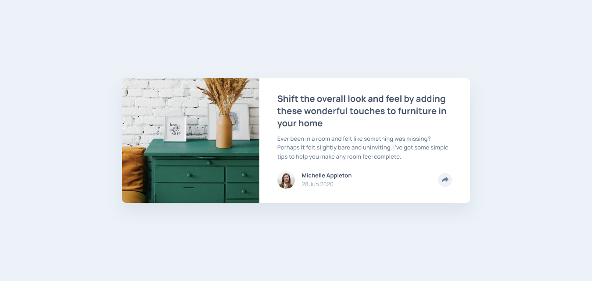

# Frontend Mentor - Article preview component solution

This is a solution to the [Article preview component challenge on Frontend Mentor](https://www.frontendmentor.io/challenges/article-preview-component-dYBN_pYFT). Frontend Mentor challenges help you improve your coding skills by building realistic projects. 

## Table of contents

- [Overview](#overview)
  - [The challenge](#the-challenge)
  - [Screenshot](#screenshot)
  - [Links](#links)
- [My process](#my-process)
  - [Built with](#built-with)
  - [What I learned](#what-i-learned)
  - [Continued development](#continued-development)
  - [Useful resources](#useful-resources)
- [Author](#author)

## Overview

### The challenge

Users should be able to:

- View the optimal layout for the component depending on their device's screen size
- See the social media share links when they click the share icon

### Screenshot



### Links

- Solution URL: [Add solution URL here](https://your-solution-url.com)
- Live Site URL: [https://lucasngtg.github.io/article-preview-component/](https://lucasngtg.github.io/article-preview-component/)

## My process

### Built with

- Semantic HTML5 markup
- CSS custom properties
- Flexbox
- CSS Grid
- Mobile-first workflow

### What I learned

The most notable thing I learned during this project was how to set the position of elements relative to another element using JavaScript.

Here is a code snippet:

```function setCoordsRelativeToBtn() {
    let btnCoords = shareBtn.getBoundingClientRect();
    let segmentCoords = shareSegment.getBoundingClientRect();

    shareSegment.style.left = btnCoords.left + btnCoords.width / 2 - segmentCoords.width / 2 + "px";
    shareSegment.style.top = btnCoords.top + window.scrollY - segmentCoords.height - 28 + "px";
}
```

### Continued development

I want to get better at identifying the scenarios in which it is better to use flexbox or grid.

### Useful resources

- [javascript.info/coordinates](https://javascript.info/coordinates) - This is a great article explaining how to get coordinates of css elements.
- [websiteplanet.com](https://www.websiteplanet.com/webtools/sharelink/) - This is a website that I used to generate the social media share links.
- [A new approach to container and wrapper classes](https://www.youtube.com/watch?v=c13gpBrnGEw) - This is a video by Kevin Powell demonstrating a different way to make containers. Of course, I had to try it for myself.

## Author

- Frontend Mentor - [@LucasNgTg](https://www.frontendmentor.io/profile/LucasNgTg)
- GitHub - [@LucasNgTg](https://https://github.com/LucasNgTg)